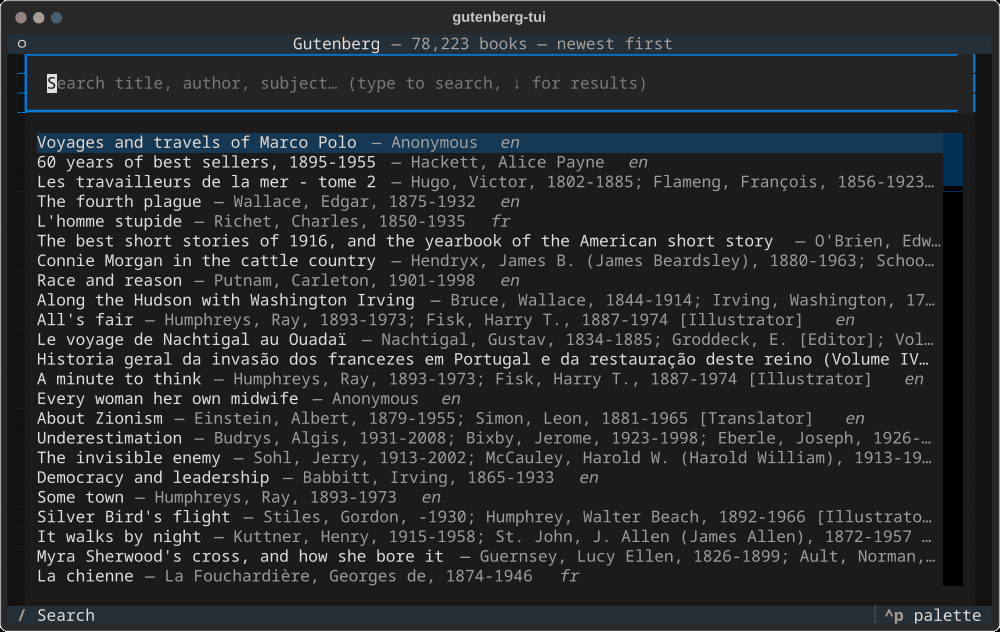

# gutenberg-tui

A terminal UI for [Project Gutenberg](https://www.gutenberg.org): browse and
search the catalogue, read books in the terminal, search inside a book, and
keep a personal shelf of books saved locally. No account or login is involved;
the app only makes plain HTTP GETs against gutenberg.org.



## Install and run

Requires Python 3.12+ and [uv](https://docs.astral.sh/uv/).

```bash
uv sync
uv run gutenberg-tui
```

On first start the app downloads the Gutenberg catalogue (about 21 MB) and
indexes it locally. It refreshes the catalogue in the background when it is
more than a week old, or on demand with `r`.

## Keys

Search screen

| Key | Action |
|-----|--------|
| type | search title, author, subject, bookshelf (prefix matching) |
| `↓` / `enter` | move from the search box to the results |
| `/` | back to the search box |
| `enter` | read the highlighted book |
| `a` | add to shelf (downloads the text) |
| `i` | book details |
| `b` | browse by bookshelf or language |
| `s` | my shelf |
| `r` | re-download the catalogue |
| `q` | quit |

Browse: `t` switches between bookshelves and languages, `tab` moves between
panes, `esc` goes back. Shelf: `d` removes the book and its local file.

Reader

| Key | Action |
|-----|--------|
| `j` `k` `↑` `↓` | scroll a line |
| `space` `b` `pgdn` `pgup` | scroll a page |
| `g` `G` | start / end |
| `/` | search in the book, then `n` / `N` for next / previous match |
| `a` | add to shelf |
| `i` | book details |
| `esc` `q` | back |

The header shows the position in percent and, while searching, the current
match. Reading positions are remembered for books on the shelf.

## Data

Everything lives in `~/.local/share/gutenberg-tui/` (or the directory named by
`GUTENBERG_TUI_DATA`): `catalog.db` holds the catalogue index, the shelf and
reading positions; `books/<id>.txt` holds downloaded books. Books you have
opened once or added to the shelf can be read offline.

## Development

```bash
uv run pytest
```

The design is described in `docs/superpowers/specs/`.
